<picture>
  
</picture>

### `> EXECUTE_LINKS.sh`

### `> GITHUB_ANALYTICS // ACTIVITY_METRICS`

<picture>
  <source media="(prefers-color-scheme: dark)" srcset="https://streak-stats.demolab.com/?user=EmmanuelArangoV&background=020617&stroke=38bdf8&ring=38bdf8&fire=38bdf8&currStreakNum=f8fafc&sideNums=7dd3fc&currStreakLabel=38bdf8&sideLabels=38bdf8&dates=7dd3fc&hide_border=true" />
  <source media="(prefers-color-scheme: light)" srcset="https://streak-stats.demolab.com/?user=EmmanuelArangoV&background=f1f5f9&stroke=2563eb&ring=2563eb&fire=2563eb&currStreakNum=0f172a&sideNums=64748b&currStreakLabel=1d4ed8&sideLabels=1d4ed8&dates=64748b&hide_border=true" />
  
</picture>

  

<picture>
  <source media="(prefers-color-scheme: dark)" srcset="https://github-readme-activity-graph.vercel.app/graph?username=EmmanuelArangoV&bg_color=020617&color=38bdf8&line=1d4ed8&point=38bdf8&hide_border=true&area=true&area_color=1d4ed8" />
  <source media="(prefers-color-scheme: light)" srcset="https://github-readme-activity-graph.vercel.app/graph?username=EmmanuelArangoV&bg_color=f1f5f9&color=1d4ed8&line=2563eb&point=1e3a8a&hide_border=true&area=true&area_color=3b82f6" />
  
</picture>

<picture>
  <source media="(prefers-color-scheme: dark)" srcset="https://raw.githubusercontent.com/platane/snk/output/github-contribution-grid-snake-dark.svg" />
  <source media="(prefers-color-scheme: light)" srcset="https://raw.githubusercontent.com/platane/snk/output/github-contribution-grid-snake.svg" />
  
</picture>

### `> END OF TRANSMISION`
<picture>
  
</picture>

