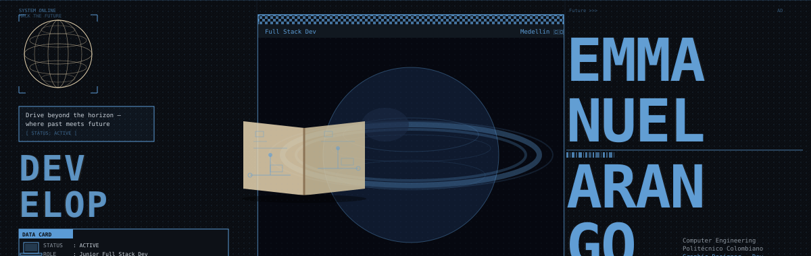

```ascii
╭──────────────────────────────────────────────────────────────────────────────╮
│  EmmanuelArangoV / README.md                          Github / @EmmanuelArangoV │
╰──────────────────────────────────────────────────────────────────────────────╯
```
<strong>VHS Retro Profile</strong>
  <source media="(prefers-color-scheme: light)" srcset="assets/banner-bw-light.svg">
  

<div>
  <strong>PROFILE</strong><br/>
  name: emmanuel.arango.velasquez<br/>
  role: Computer Engineering Student · Juniot Full-Stack Developer · Graphic Designer<br/>
  location: Medellin, Colombia<br/>
  languages: Spanish (native) · English (B2 — APTIS certified)<br/>
  status: Building. Shipping. Iterating.<br/>
  mission: Turn ideas into measurable, well-designed software.
</div>

[](https://github.com/EmmanuelArangoV)
[](https://github.com/EmmanuelArangoV)
[](https://github.com/EmmanuelArangoV)
[](https://www.linkedin.com/in/emmanuel-arango-1795b5367)
[](mailto:emmanuelarangov@gmail.com)

---

### `> ABOUT_ME`

<div>
  
  <strong>Backend</strong> — Building scalable services with Java + Spring Boot, clean REST APIs and solid JDBC/SQL foundations.<br/>
  
  <strong>Web</strong> — Shipping interfaces with React, Next.js, TypeScript — typed end-to-end.<br/>
  
  <strong>Design</strong> — Fluent in Figma, Photoshop, Illustrator, Canva; UI/UX oriented.<br/>
  
  <strong>AI</strong> — Co-built PROMISE, an AI-Agents platform (1st place RIWI Hackathon).<br/>
  
  <strong>Data</strong> — Database Administration, ETL pipelines, IBM Data Engineering certified.<br/>
  
  <strong>Collaboration</strong> — Comfortable working in English & Spanish across teams.
</div>

---

### `> TECH_STACK`

**Languages**


**Backend & Data**


**Frontend & Tooling**


**Design**


---

### `> FEATURED_PROJECTS`

<table>
  <tr>
    <td>
      
      <strong> PROMISE</strong><br/>
      AI-Agents platform — landing, dashboard, voice AI.<br/>
      <em>Java · Spring · Next.js · AI</em><br/>
      <a href="https://github.com/EmmanuelArangoV/promise-integrative-project">promise-integrative-project</a>
    </td>
    <td>
      
      <strong> SofIA Integral</strong><br/>
      Integrative academic platform with modular services & clean API design.<br/>
      <em>Java · Spring Boot · REST · SQL</em><br/>
      <a href="https://github.com/EmmanuelArangoV/SofIA-Integral">SofIA-Integral</a>
    </td>
  </tr>
  <tr>
    <td>
      
      <strong> KitchenIQ API</strong><br/>
      Backend for a smart kitchen management system: recipes, stock, orders.<br/>
      <em>Java · Spring Boot · PostgreSQL</em><br/>
      <a href="https://github.com/EmmanuelArangoV/kitcheniq-api">kitcheniq-api</a>
    </td>
    <td>
      
      <strong> KitchenIQ UI</strong><br/>
      Frontend client — typed end-to-end, responsive, design-system driven.<br/>
      <em>Next.js · React · TypeScript · Tailwind</em><br/>
      <a href="https://github.com/EmmanuelArangoV/kitcheniq-ui">kitcheniq-ui</a>
    </td>
  </tr>
  <tr>
    <td>
      
      <strong> Horus Braslet</strong><br/>
      Full-stack experiment for IoT/data tracking with a UX focus.<br/>
      <em>System design · Prototyping</em><br/>
      <a href="https://github.com/EmmanuelArangoV/horus-braslet">horus-braslet</a>
    </td>
    <td>
      
      <strong> Explore Further</strong><br/>
      More repositories and experiments.
      <br/>
      <a href="https://github.com/EmmanuelArangoV?tab=repositories">github.com/EmmanuelArangoV</a>
    </td>
  </tr>
</table>

---

### `> SYSTEM_METRICS`

<div align="center">


</div>

---

### `> EXPERIENCE & EDUCATION`

```log
[2024 — now]  RIWI · Trainee Full-Stack Developer
              ↳ Java / Spring · React / Next.js · SQL · Agile teams
[2023 — now]  B.Sc. Computer Engineering · ongoing
              ↳ Focus: software architecture, data systems, AI
[—————]      Graphic Designer · freelance projects
              ↳ Branding, social pieces, UI mockups (Photoshop / Illustrator / Figma)
```

### `> CERTIFICATIONS`

```log
✔ IBM Data Engineering Professional Certificate
✔ Database Administration (DBA)
✔ SQL for Data Science
✔ APTIS — English B2
```

---

### `> CONTACT // follow the signal`

[](mailto:emmanuelarangov@gmail.com)
[](https://www.linkedin.com/in/emmanuel-arango-1795b5367)
[](https://github.com/EmmanuelArangoV)
[](#)

<div align="center">


```ascii
> END_OF_TRANSMISSION_                              ░▒▓ CYBER-DRIVE // 2026 ▓▒░
```

</div>
